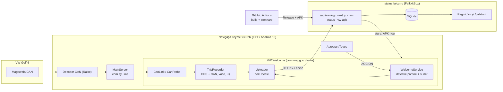

# VW Welcome

Aplicație Android pentru navigația **Teyes CC3 2K** din **VW Golf 6** (1.2 TSI, 2012):
redă un sunet de bun venit la fiecare pornire a mașinii și a crescut într-un mic
„calculator de bord” conectat: călătorii cu hartă, date de la mașină, mentenanță, voce în
mers, actualizări din aplicație. Totul se vede și de la distanță, pe `status.faicu.ro`.

| | |
|---|---|
| **Versiune curentă** | 1.1.25 (`build-25`), pachet `com.mapgoo.diruite` |
| **Descărcare** | [VWWelcome.apk (ultimul build)](https://github.com/Faicu/welcometovw/releases/latest/download/VWWelcome.apk) sau din aplicație, „Actualizează acum” |
| **De la distanță** | `status.faicu.ro/vw` (jurnal) · `status.faicu.ro/calatorii` (călătorii, poziție, mentenanță) |
| **Actualizat** | 30.09.2026 |

---

## Pe scurt: unde suntem

- ✅ **Sunetul de bun venit merge sigur**, atât după opririle scurte, cât și după hibernare,
  confirmat pe mașină, cu sunetul auzit întreg.
- ✅ **Aplicația nu mai e închisă de Teyes la somn**, pentru că poartă numele unui pachet
  de pe lista albă a firmware-ului.
- ✅ **Datele de la mașină se citesc**: viteză, turație, tensiune, kilometraj,
  temperatură, uși.
- 🧪 **Călătoriile, vocea în mers, mentenanța și actualizarea din aplicație** sunt
  construite și merg pe server, dar încă nu au fost văzute în uz real pe navigație.
- 🔍 **În lucru:** găsirea nivelului de combustibil, pentru consumul pe fiecare
  călătorie.

**Legendă:** ✅ confirmat pe navigație · 🧪 construit, netestat în uz real · 🔍 în lucru ·
💡 idee / neînceput

---

## Stadiul funcțiilor

### Sunetul de bun venit

| Funcție | Stare | Detalii |
|---|---|---|
| Sunet la pornire după o oprire scurtă | ✅ | Prin autostart-ul Teyes („VW Welcome Start”). La opriri scurte navigația nu doarme deloc |
| Sunet după hibernare (opriri lungi) | ✅ | Serviciul supraviețuiește somnului și măsoară pauza. Testat ~1 h și ~8 min |
| Pauză înainte de redare | ✅ | 5 s, plus încă 2 s după o hibernare adevărată: amplificatorul pornește mai greu |
| Anti-dublare | ✅ | Autostart și pauza detectată în același timp dau o singură redare (fereastră de 20 s) |
| Mai multe sunete, la rând sau aleatoriu, volum propriu | ✅ | Adăugare din lista proprie de fișiere audio: navigația nu are selector de fișiere |
| Deschiderea aplicației nu redă sunetul | ✅ | |

### Aplicația și diagnosticul

| Funcție | Stare | Detalii |
|---|---|---|
| Interfață nouă (temă întunecată, file Acasă / Sunete / Setări / Jurnal) | ✅ | |
| Iconița proprie („FAIKKITVW”) | ✅ | |
| Jurnal trimis live la server | ✅ | Coadă locală, nu se pierde nimic fără semnal |
| Căderile aplicației ajung în jurnal | ✅ | Cu eroarea exactă |
| Actualizare din aplicație | 🧪 | CI-ul publică APK-ul pe server, iar aplicația îl descarcă și îl instalează. De testat la 1.1.22 |

### Datele mașinii și călătoriile

| Funcție | Stare | Detalii |
|---|---|---|
| Citirea datelor CAN prin MainServer | ✅ | Găsite cu sonda și calibrarea ghidată, vezi [Datele mașinii](#datele-mașinii-can) |
| Calibrare doar pentru ce nu știm (frână, marșarier, centură, clima, ștergătoare, rezervor) | 🧪 | Arată live ce s-a schimbat la fiecare pas; sonda pornește doar de aici |
| Înregistrarea călătoriilor (GPS + CAN) | ✅ | Punct la 5 s în mers, 30 s pe loc cu motorul pornit, nimic cu motorul oprit. Primul drum real pe 01.10 |
| Pagina `/calatorii`: hartă, grafic viteză/turație, totaluri | 🧪 | Testată pe server cu date de probă; așteaptă primul drum real |
| „Unde e mașina” (ultima poziție, Google Maps) | 🧪 | |
| GPS oprit cu motorul oprit | ✅ | Văzut în jurnal pe 01.10. După 1 min cu turația 0, pornit din nou la turație sau mers |
| Mentenanță după km/dată (ulei, ITP, RCA, rovinietă, distribuție) | 🧪 | Se editează pe `/calatorii`; cele scadente apar și pe navigație și în salut |
| Salut vorbit după 3 min de mers | ✅ | Ora zilei, temperatura de afară, mentenanța scadentă. Google TTS are română (rostit pe 01.10) |
| Avertizare „ușă deschisă” în mers (≥ 5 km/h) | 🧪 | Voce sau bip |
| Nivelul combustibilului / consum pe călătorie | 🔍 | „Car Info” afișa litrii, dar acum nu mai arată nimic. Calibrare → „Doar rezervorul”: o captură înainte și una după alimentare, comparate pe server |
| Jurnal de alimentări și cost pe călătorie | 💡 | Depinde de rezultatul de mai sus |

---

## Ce urmează

1. **La mașină:** calibrarea nouă (Acasă → „Calibrare CAN”) pentru frână, marșarier,
   centură, clima și ștergătoare; „Doar rezervorul” înainte și după o alimentare.
2. **Consumul:** cu codul rezervorului găsit, alimentările se detectează automat, iar
   consumul și costul se calculează pe fiecare călătorie. Fără el: jurnal de alimentări
   introdus manual, plus estimare calibrată din turație și timp (±10–15%).
3. **Primele drumuri reale:** verificarea traseelor, a distanțelor și a împărțirii în
   călătorii pe `/calatorii`.
4. **Vocea:** Setări → „Ascultă salutul acum”. Jurnalul arată dacă există un motor de
   voce în română. Dacă nu există, salutul se face din MP3-uri sau se instalează un
   motor de voce.
5. **De decis:** alertă pe telefon la pornirea mașinii, ore de liniște, codurile rămase
   ambigue (frână de mână, marșarier, centură), un adaptor OBD2 pentru consum instantaneu.

---

## Arhitectura

---

## Cum detectează pornirea mașinii

Navigația se comportă diferit în funcție de cât stă oprit contactul, așa că aplicația
folosește mai multe căi, iar prima care prinde pornirea redă sunetul:

| Situație | Ce face Teyes | Ce prinde pornirea |
|---|---|---|
| Oprire scurtă (sub ~10 min) | Doar stinge ecranul; procesorul merge mai departe | **Autostart-ul Teyes**, care lansează „VW Welcome Start” la ACC ON |
| Oprire lungă | Intră în somn la ~10 min după ACC OFF | **Pauza măsurată de serviciu**; de obicei vine și autostart-ul |
| Boot complet (după ~72 h sau reporniri periodice) | Pornește de la zero | **Contorul de boot-uri** Android |

Autostart-ul Teyes nu e 100% sigur (a ratat o dată din câteva). Detecția prin pauză
acoperă acele cazuri.

---

## Ce am aflat despre Teyes CC3 2K

| Aspect | Constatare |
|---|---|
| Platforma | FYT/SYU pe Unisoc UMS512 (`sprd ums512_1h10_Natv`), Android 10 |
| Închiderea aplicațiilor | La somn, MainServer (`com.syu.ms`) oprește forțat tot ce nu e în `unkill_app.txt` (din APK-ul lui), `skipkillapp.prop` sau `protected_app.txt` |
| Autostart | `/oem/app/pwctl_config.xml` („LaunchWhiteList”) decide cine are voie să pornească automat |
| Soluția | Aplicația poartă numele `com.mapgoo.diruite`, prezent pe ambele liste și neinstalat pe navigație. Merge fără root |
| Lipsuri | Nu are selector de fișiere Android (nici `OPEN_DOCUMENT`, nici `GET_CONTENT`) |
| Datele mașinii | MainServer le distribuie prin AIDL-ul `com.syu.ipc`, fără permisiuni (vezi `Syu.java`) |

---

## Datele mașinii (CAN)

Găsite cu sonda CAN și cu calibrarea ghidată. Modul 7 = CANBUS, modul 0 = principal.

| Cod | Ce e | Exemplu |
|---|---|---|
| m7 c110 (= c1032) | Turația | ~750 rpm la relanti |
| m7 c1031 / c109 | Viteza (km/h / ×100) | 31 / 3171 |
| m7 c105 | Tensiunea bateriei (×100) | 1400 = 14,0 V |
| m7 c106 | Kilometrajul | 245.067 km |
| m7 c139 | Temperatura exterioară (×10), probabil | 230 = 23,0 °C |
| m7 c1 … c5 | Ușa șoferului, pasager față, spate stânga, spate dreapta, portbagaj | 1 = deschis |
| m7 c103, c107, c101 | Frână, marșarier, centură (ambigue) | 0/1 |
| m0 c179 | Poziția GPS a unității | lon, lat, alt |
| m7 c1019 | Cadrele brute ale decodorului (protocol Raise, antet 0x2E) | clima, radar, uși, volan, date de bord |
| — | Luminile, semnalizarea, avariile | nu sunt transmise de decodor |
| ? | Litrii din rezervor | în căutare, prin capturi înainte/după alimentare |

---

## Serverul `status.faicu.ro` (FaikkitBox)

Codul e în `/opt/faikkitbox` (repo separat). Rutele VW folosesc cheia `VW_LOG_TOKEN`.

| Rută / pagină | Rol |
|---|---|
| `POST /api/vw-log` | Jurnalul aplicației (tabela `vw_log`, ultimele 200.000 de linii) |
| `POST /api/vw-trip` | Punctele de traseu (tabela `vw_trip_point`) |
| `GET /api/vw-status` | Kilometraj, mentenanță și ultimul APK, citite de aplicație |
| `POST /api/vw-apk`, `GET /api/vw-apk/download` | APK-ul publicat de CI și descărcat de aplicație |
| `/vw` (admin) | Jurnalul live, cu filtru „doar evenimente” |
| `/calatorii` (admin) | Unde e mașina, totaluri, lista călătoriilor, hartă, grafic, mentenanță |

---

## Instalare și configurare pe navigație

1. Instalează APK-ul. Versiunile următoare vin din aplicație: Acasă → „Actualizează acum”.
2. **Sunete:** „+ Adaugă sunete” și alegi din lista fișierelor audio de pe navigație.
3. **Setări:** dezactivează optimizarea bateriei și permite localizarea când ți se cere.
4. **Autostart Teyes:** adaugă „VW Welcome Start”.
5. Test: Acasă → „▶ Redă acum”.

---

## Build, semnare și publicare

- GitHub Actions (`.github/workflows/build.yml`), Gradle 8.7 / JDK 17, la fiecare push:
  APK de debug semnat, GitHub Release `build-N` (marcat „latest”) și publicare pe
  `status.faicu.ro/api/vw-apk`. Commit-urile cu `[skip ci]` nu fac build.
- Versiune: `versionCode` = numărul build-ului, `versionName` = `1.1.<N>`.
- Secretele repo-ului (Settings → Secrets and variables → Actions):
  - `KEYSTORE_BASE64`, `KEYSTORE_PASSWORD`: cheia de semnare (PKCS12, alias `vwwelcome`).
    Aceeași cheie la fiecare build, altfel actualizarea cere dezinstalare. **Păstrează o
    copie a keystore-ului.**
  - `VW_LOG_TOKEN`: cheia pentru `status.faicu.ro`, aceeași ca în `/opt/faikkitbox/.env`.
- Local: `gradle assembleDebug` (necesită Android SDK cu platforma 34).

---

## Structura codului

`app/src/main/java/ro/faicu/vwwelcome/` (Java, fără AndroidX, UI construit din cod, ~3.300 de linii):

| Fișier | Rol |
|---|---|
| `WelcomeService` | Serviciul permanent: detecția pornirii, tick-ul de 5 s, rețea, pornește restul |
| `StartActivity`, `BootReceiver` | Intrarea invizibilă pentru autostart; pornirea la boot/actualizare |
| `Player` | Redarea sunetului (focus audio, volum, pauză) |
| `TripRecorder`, `PointQueue` | Călătoriile (GPS + CAN), salutul, avertizarea de ușă, GPS-ul econom; coada de puncte pe disc |
| `CanLink`, `CanProbe`, `Syu` | Datele mașinii din MainServer: legătura permanentă, sonda calibrării, protocolul |
| `Speaker`, `Greeting` | Vocea (TextToSpeech, ro-RO) și textele rostite |
| `Uploader`, `VwStatus`, `Updater` | Trimiterea la server, starea de pe server, actualizarea din aplicație |
| `Prefs`, `CrashLog` | Setări și jurnal, căderile |
| `MainActivity`, `Ui` | Interfața |

Detaliile tehnice pentru dezvoltare (inclusiv pentru Claude) sunt în [`CLAUDE.md`](CLAUDE.md).

---

## Istoricul versiunilor

| Build | Data | Ce a adus |
|---|---|---|
| 1–7 | 29.09 | Prima versiune: sunet la trezire, mai multe sunete, istoric, jurnal, semnare fixă |
| 8–10 | 29.09 | Diagnostic extins, „VW Welcome Start” pentru autostart, jurnal trimis la server |
| 11 | 30.09 | Reparat: căderea la adăugarea sunetelor (navigația nu are selector de fișiere) |
| 12 | 30.09 | Autostart-ul redă direct: la opriri scurte navigația nu doarme deloc |
| 13–14 | 30.09 | Diagnostic Teyes: găsite listele FYT de aplicații protejate |
| 15 | 30.09 | **Pachetul `com.mapgoo.diruite`:** aplicația supraviețuiește somnului |
| 16 | 30.09 | +2 s pauză după hibernare |
| 17–18 | 30.09 | Interfață nouă, sonda CAN |
| 19–20 | 30.09 | Călătorii (GPS + CAN), calibrare CAN, iconița proprie |
| 21 | 30.09 | Salut vorbit, avertizare ușă, mentenanță, „unde e mașina”, actualizare din aplicație |
| 22 | 30.09 | Sonda CAN extinsă (căutarea nivelului de combustibil) |
| 23 | 30.09 | Curățenie: motorul oprit detectat corect (GPS econom, resetarea salutului), cod mort scos |
| 24 | 30.09 | Calibrare doar pentru necunoscute, cu schimbările afișate live; derularea nu mai sare sus |
| 25 | 01.10 | Curățenie: scos diagnosticul Teyes și sonda separată; rezervorul prin capturi înainte/după alimentare |

---

## Limitări cunoscute

- **Autostart-ul Teyes** ratează uneori, dar detecția prin pauză acoperă cazurile cu somn.
  După o oprire scurtă în care ratează, nu se aude nimic, pentru că nu există altă cale.
- **Salutul vorbit și avertizarea de ușă** merg doar cu înregistrarea călătoriilor pornită.
- **Vocea** depinde de un motor TextToSpeech cu limba română pe navigație. Încă neverificat.
- **Pachetul `com.mapgoo.diruite`** e împrumutat de pe lista albă Teyes. Dacă un firmware
  nou schimbă lista, aplicația poate fi din nou închisă la somn, iar jurnalul o arată imediat.
- **Codurile CAN** sunt găsite empiric pe această mașină și pe acest decodor. Alt decodor
  poate folosi alte coduri.
