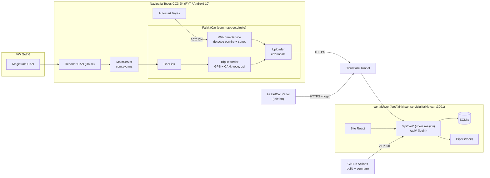

# FaikkitCar

„Calculator de bord” conectat pentru **VW Golf 6** (1.2 TSI CBZB, 2012) cu navigația
**Teyes CC3 2K**. A pornit ca „VW Welcome”, un sunet de bun venit la fiecare pornire, și
a crescut într-un proiect cu trei părți:

| Parte | Ce e | Unde |
|---|---|---|
| **FaikkitCar** (`app/`) | Aplicația din mașină: sunetul de bun venit, călătoriile (GPS + datele mașinii), vocea în mers, jurnalul | Navigația Teyes, pachet `com.mapgoo.diruite` |
| **car.faicu.ro** (`web/`) | Serverul și site-ul: poziția mașinii, călătorii cu hartă și grafic, consum și cost, alimentări, mentenanță, jurnal | Serverul de acasă, `/opt/faikkitcar`, serviciul `faikkitcar` |
| **FaikkitCar Panel** (`panel/`) | Aplicația de telefon, nativă, cu aceleași date ca site-ul | Telefonul, pachet `ro.faicu.faikkitcar.panel` |

| | |
|---|---|
| **Versiuni** | FaikkitCar 1.1.36 (`build-36`) · FaikkitCar Panel 1.0.4 (`panel-4`) |
| **Descărcare** | Mașina: [FaikkitCar.apk](https://github.com/Faicu/FaikkitCar/releases/latest/download/FaikkitCar.apk) sau din aplicație, „Actualizează acum” · Telefonul: car.faicu.ro → fila Mai mult, „Descarcă APK” |
| **Site** | https://car.faicu.ro (login în `/opt/faikkitcar/.env`) |
| **Repo** | `Faicu/FaikkitCar` (fost `welcometovw`) |
| **Actualizat** | 01.10.2026 |

**Legendă:** ✅ confirmat în uz real · 🧪 construit, netestat în uz real · 🔍 în lucru ·
💡 idee / neînceput

---

## Pe scurt: unde suntem (02.10.2026)

- ✅ **Sunetul de bun venit** merge după opririle scurte (autostart Teyes) și după
  hibernare. Începutul se tăia după un somn lung; de la 1.1.28 se redă întâi 1,2 s de
  liniște, iar în jurnal redările arată „după 1200 ms de liniște”.
- ✅ **Aplicația nu mai e închisă de Teyes la somn** (poartă un nume de pe lista albă).
- ✅ **Datele mașinii** sunt identificate și confirmate: viteză, turație, tensiune,
  kilometraj, temperatură, uși, centură, frâna de mână, clima, lumini și **litrii din
  rezervor** (confirmat la alimentarea din 01.10).
- ✅ **Călătoriile** se înregistrează, iar GPS-ul se oprește singur cu motorul oprit.
- ✅ **Salutul vorbit** merge, cu vocea Piper „Mihai” de pe server (vocile Google de pe
  navigație sună robotic).
- ✅ **Actualizarea din aplicație** merge (1.1.24 → 1.1.27 → 1.1.30 → 1.1.31).
- ✅ **În mașină rulează FaikkitCar 1.1.34**, pe telefon Panel 1.0.2. Coada păstrată de
  1.1.31 a ajuns pe car.faicu.ro.
- ✅ **Contactul dedus din datele de bord** se potrivește cu realitatea pe drumurile din
  01.10 seara: „luat” exact la oprirea motorului, „pus” la pornire. Netestat încă: contact
  pus cu motorul oprit („Doar contact”).
- ✅ **Marșarierul are cod**: m0 c68 = [1, 1] cât e băgat (verificat de 4 ori).
- ✅ **Proiectul e separat de FaikkitBox**: are server, site, domeniu, serviciu și repo
  proprii. Datele au fost mutate și verificate rând cu rând.
- ✅ **FaikkitCar Panel** e instalat pe telefon, iar login-ul și datele merg.
- 🧪 **Consumul pe călătorie** se estimează din viteză și turație și se corectează automat
  din nivelul rezervorului, după ~8 L consumați.
- 🧪 **Combinarea călătoriilor** (ex. dus-întors cu o oprire scurtă), pe site și în Panel:
  publicată (Panel 1.0.3).

---

## Ce urmează

1. **Instalează actualizările:** FaikkitCar 1.1.36 (în mașină, „Actualizează acum”) și
   Panel 1.0.4 (pe telefon, la fel). Apoi de comparat cu bordul: temperaturile setate ale
   climei și consumul instantaneu („Consum acum”).
2. **Alimentări:** se trece fiecare pe car.faicu.ro sau în Panel, cu prețul de pe bon, ca
   să iasă costul pe drum. Plinul nu mai e necesar.
3. **De verificat în uz:** avertizarea „ușă deschisă” în mers și consumul calibrat după
   primii ~8 L.
4. **Idei:** alertă pe telefon la pornirea mașinii (prin Panel), alimentări detectate
   automat din salturile rezervorului, ore de liniște, sunet după ora zilei, adaptor OBD2
   pentru consum instantaneu, voce și mai naturală (Azure / ElevenLabs).

---

## Stadiul funcțiilor

### Sunetul de bun venit

| Funcție | Stare | Detalii |
|---|---|---|
| Sunet la pornire după o oprire scurtă | ✅ | Prin autostart-ul Teyes („FaikkitCar Start”). La opriri scurte navigația nu doarme deloc |
| Sunet după hibernare (opriri lungi) | ✅ | Serviciul supraviețuiește somnului și măsoară pauza |
| Pauză înainte de redare | ✅ | 5 s, plus încă ceva după o hibernare adevărată (implicit 2 s, pe mașină 3 s din Setări) |
| Începutul sunetului nu se taie | 🧪 | Se tăia ~0,5 s după somn lung, chiar și cu 8 s pauză: ieșirea audio Teyes pornește abia cu primul sunet. De la 1.1.28: 1,2 s de liniște înainte |
| Anti-dublare | ✅ | Autostart și pauza detectată în același timp dau o singură redare (fereastră de 20 s) |
| Mai multe sunete, la rând sau aleatoriu, volum propriu | ✅ | Adăugare din lista proprie de fișiere audio: navigația nu are selector de fișiere |
| Deschiderea aplicației nu redă sunetul | ✅ | |

### Aplicația din mașină

| Funcție | Stare | Detalii |
|---|---|---|
| Nume nou: FaikkitCar / FaikkitCar Start | 🧪 | Din 1.1.32. Pachetul și componentele rămân aceleași, deci lista albă și autostart-ul Teyes nu se schimbă |
| Interfață (temă întunecată, file Acasă / Sunete / Setări / Jurnal) | ✅ | |
| Iconița FaikkitCar (săgeată de navigație) | 🧪 | Din 1.1.34, la fel în Panel și pe site |
| Jurnal trimis live la server | ✅ | Coadă locală (2.000 de linii); la orice eroare a serverului datele rămân în coadă |
| Căderile aplicației ajung în jurnal | ✅ | Cu eroarea exactă |
| Actualizare din aplicație | ✅ | CI-ul publică APK-ul pe car.faicu.ro, aplicația îl descarcă și îl instalează |
| Calibrare CAN | 🧪 | Doar ce a rămas nesigur (c107 și marșarierul), în Setări („avansat”). Nu e necesară |
| Scos | — | Diagnosticul Teyes, sonda CAN separată, pasul „rezervor” (codul e confirmat) |

### Datele mașinii, călătoriile și consumul

| Funcție | Stare | Detalii |
|---|---|---|
| Citirea datelor CAN prin MainServer | ✅ | Vezi [Datele mașinii](#datele-mașinii-can) |
| Înregistrarea călătoriilor (GPS + CAN) | ✅ | Punct la 5 s în mers, 30 s pe loc cu motorul pornit, nimic cu motorul oprit |
| GPS oprit cu motorul oprit | ✅ | După 1 min cu turația 0; pornit din nou la turație sau mers |
| Nivelul combustibilului | ✅ | c104, în litri; 21 → 38 L la alimentarea de 16,0 L din 01.10. Cu motorul oprit, decodorul trimite 0 (ignorat) |
| Consum și cost pe călătorie | 🧪 | Estimare din viteză și turație (model fizic), corectată automat din nivelul rezervorului după ~8 L consumați; costul cu prețul ultimei alimentări |
| Alimentări | ✅ | Pe car.faicu.ro și în Panel; kilometrajul se completează automat. Plinul nu mai e necesar |
| Mentenanță după km/dată (ulei, ITP, RCA, rovinietă, distribuție) | 🧪 | Se editează pe site sau în Panel; cele scadente apar pe navigație și în salut |
| Salut vorbit după 3 min de mers | ✅ | Ora zilei, temperatura de afară, mentenanța scadentă. Vocea Piper „Mihai” de pe server; fără internet, vocea Google |
| Avertizare „ușă deschisă” în mers (≥ 5 km/h) | 🧪 | Vocea locală (fără întârziere) sau bip |

### Site-ul car.faicu.ro și FaikkitCar Panel

| Funcție | Stare | Detalii |
|---|---|---|
| Login | ✅ | Site: cookie de 180 de zile. Panel: token păstrat în aplicație |
| Patru file: Acum · Călătorii · Costuri · Mai mult | 🧪 | La fel pe site și în Panel (în Panel, filele sunt jos) |
| Acum: starea mașinii | ✅ | Oprită / Doar contact / Motor pornit / În mers, de când; viteză, turație, baterie. Contactul e dedus din datele de bord (confirmat pe 01.10) |
| Acum: mai rapid | 🧪 | De la 1.1.35 mașina trimite starea la 5 s cu motorul pornit, iar site-ul și Panel o primesc imediat (cererea așteaptă la server) |
| Acum: climă și detalii | 🧪 | De la 1.1.36: AC, AUTO, ventilator, temperaturile setate (formula de confirmat), afară; uși deschise, centură, frâna de mână, marșarier, faza scurtă, consumul instantaneu al bordului (c1033, presupus). Habitaclul nu e transmis de decodor |
| Acum: călătoria în curs | 🧪 | Distanță, durată, litri, L/100, cost, cu întârziere de ~30 s |
| Acum: rezervor și autonomie | 🧪 | Litrii de la mașină ÷ consumul mediu (real din rezervor; până atunci estimat din drumuri) |
| Unde e mașina (hartă, Google Maps) | ✅ | Ultima poziție GPS, pe fila Acum |
| Costuri: 30 de zile și pe luni | 🧪 | Pe luni: km, timp, litri, L/100, cost estimat și ce s-a dat la pompă, cu bare |
| Călătoria aleasă | ✅ | Pe ecranul ei: detalii, traseu (verde = plecare, roșu = sosire), grafic viteză/turație, rezervor |
| Combinarea călătoriilor consecutive | 🧪 | În detaliile călătoriei: „Combină cu precedenta / următoarea”, „Desparte”. Opririle dintre părți nu intră în viteza medie |
| Ascunde pornirile pe loc | ✅ | Sub 0,5 km (prinde și manevrele din parcare); totalurile le includ în continuare |
| Jurnalul navigației | ✅ | În „Mai mult”. Filtru „doar evenimente”. Nu se poate goli, ca să nu se piardă nimic |
| Panel: actualizare din aplicație | 🧪 | CI-ul publică pe car.faicu.ro; Panel-ul arată „Actualizează acum” |

---

## Arhitectura



---

## Cum detectează pornirea mașinii

| Situație | Ce face Teyes | Ce prinde pornirea |
|---|---|---|
| Oprire scurtă (sub ~10 min) | Doar stinge ecranul; procesorul merge mai departe | **Autostart-ul Teyes**, care lansează „FaikkitCar Start” la ACC ON |
| Oprire lungă | Intră în somn la ~10 min după ACC OFF | **Pauza măsurată de serviciu**; de obicei vine și autostart-ul |
| Boot complet (după ~72 h sau reporniri periodice) | Pornește de la zero | **Contorul de boot-uri** Android |

Autostart-ul Teyes nu e 100% sigur (a ratat o dată din câteva). Detecția prin pauză
acoperă acele cazuri. Ceasul navigației poate sări câteva secunde la trezire, de aceea
ordinea liniilor din jurnal poate părea inversată chiar atunci.

---

## Ce am aflat despre Teyes CC3 2K

| Aspect | Constatare |
|---|---|
| Platforma | FYT/SYU pe Unisoc UMS512 (`sprd ums512_1h10_Natv`), Android 10 |
| Închiderea aplicațiilor | La somn, MainServer (`com.syu.ms`) oprește forțat tot ce nu e în `unkill_app.txt` (din APK-ul lui), `skipkillapp.prop` sau `protected_app.txt` |
| Autostart | `/oem/app/pwctl_config.xml` („LaunchWhiteList”) decide cine are voie să pornească automat |
| Soluția | Aplicația poartă numele `com.mapgoo.diruite`, prezent pe ambele liste și neinstalat pe navigație. Merge fără root |
| Ieșirea audio | Pornește abia când începe un sunet (~0,5 s pierdute), oricât s-ar aștepta înainte |
| Voce | Google TTS cu o singură voce română (`vfv`, locală și online, la fel de robotice); cea online întârzie ~3 s |
| Lipsuri | Nu are selector de fișiere Android (nici `OPEN_DOCUMENT`, nici `GET_CONTENT`); „Car Info” nu mai afișează litrii |
| Datele mașinii | MainServer le distribuie prin AIDL-ul `com.syu.ipc`, fără permisiuni (vezi `Syu.java`) |

---

## Datele mașinii (CAN)

Decodor Raise, firmware `VW-RZ-08-0036.212.03-HSE`. Modul 7 = CANBUS, modul 0 = principal.
Găsite cu sonda și calibrările din 30.09–01.10 și verificate pe drumuri reale (viteza CAN
vs. GPS: +0,8 km/h în medie).

| Cod | Ce e | Exemplu |
|---|---|---|
| m7 c110 (= c1032) | Turația | 635–750 rpm la relanti |
| m7 c1031 / c109 | Viteza (km/h / ×100) | 31 / 3171 |
| m7 c105 | Tensiunea bateriei (×100) | 13,9–14,55 V cu motorul pornit |
| m7 c106 | Kilometrajul | 245.075 km |
| m7 c139 | Temperatura exterioară (×10) | 190 = 19,0 °C, ca pe bord |
| m7 c104 | Litrii din rezervor; 0 cu motorul oprit | 21 → 38 la alimentarea de 16 L |
| m7 c1 … c5 | Ușa șoferului, pasager față, spate stânga, spate dreapta, portbagaj | 1 = deschis |
| m7 c101 | Centura șoferului desfăcută | 1 = desfăcută |
| m7 c103 | Frâna de mână | 1 = eliberată |
| m7 raw 0x24, bitul 0x02 | Frâna de mână (confirmat din nou pe 01.10) | 6 = eliberată, 4 = trasă |
| m7 raw 0x41/1 | Biți de stare: 0x20 = frâna de mână eliberată (confirmat), 0x80 = faza scurtă (confirmat 02.10) | 0 / 32 / 128 / 160 |
| m0 c68 | Marșarierul | [1, 1] = băgat; [9, 1] după ce iese; [0, 0] la pornire |
| m7 c21, c27/c28, c11, c49 | Clima: treapta ventilatorului, temperatura stânga/dreapta (pași de 0,5 °C), AC, AUTO | 3, 11, 1, 1 |
| m7 raw 0x14 | Luminile aprinse (iluminarea bordului) | 0 / 84 |
| m7 raw 0x41/2 | Cadrul de bord: turație (2 B), viteză (2 B), tensiune (2 B), temperatură (2 B), kilometraj (3 B), litri (1 B) | |
| m7 c1019 | Cadrele brute ale decodorului (protocol Raise, antet 0x2E) | clima, radar, uși, volan, date de bord |
| m0 c179 | Poziția GPS a unității | lon, lat, alt |
| — | Pedala de frână, semnalizarea, avariile, ștergătoarele | nu sunt transmise de decodor |
| m7 c1033 | Probabil consumul instantaneu al bordului ×10 (L/100 km), doar în mers | 300 la accelerare, ~30 la rulare |
| m7 c107 | Neclar (a sărit pe 1 la eliberarea frânei de mână) | |

---

## Consumul de combustibil

- **Estimarea pe drum** (`web/server/fuel-model.ts`) folosește un model fizic al
  Golf-ului: accelerări, aer, rulare, plus rotațiile motorului (frecări, mers în gol).
  Calculează litri, L/100 km și timpul stat pe loc cu motorul pornit.
- **Consumul real** vine din nivelul rezervorului citit de la mașină: nivelul de la început
  − nivelul de acum + ce s-a alimentat între timp (saltul de cel puțin 3 L). E calculat pe
  ultimele 90 de zile.
- **Corecția:** după ~8 L consumați, estimarea de pe fiecare drum e înmulțită cu raportul
  „real / estimat”. Fără nivel, corecția vine din plinuri.
- **Costul** = litrii estimați × prețul ultimei alimentări introduse.
- **Mai precis** s-ar putea cu un adaptor OBD2 Bluetooth (presiune admisie + temperatură
  aer + turație), ~5% pe orice drum.

---

## Serverul `car.faicu.ro` (`web/`)

Rulează pe același server cu FaikkitBox, dar complet separat:

| | |
|---|---|
| Cod | `/opt/faikkitcar/web`: Node 22 (rulează direct TypeScript), Hono, `node:sqlite`, site React + Vite + Tailwind |
| Serviciu | systemd `faikkitcar` (unitatea în `deploy/faikkitcar.service`, utilizatorul `faikkitcar`, scrie doar în `data/`) |
| Rețea | Portul 3001; Cloudflare Tunnel `car.faicu.ro` → `http://192.168.1.192:3001` |
| Config | `/opt/faikkitcar/.env` (nu e în git): `PORT`, `ADMIN_USER` / `ADMIN_PASS`, `SESSION_SECRET`, `CAR_TOKEN` |
| Date | `/opt/faikkitcar/data`: `faikkitcar.db` (tabele `log`, `trip_point`, `reminder`, `refuel`), `apk/`, `tts/` (cache voce), `piper/` (vocea, nu e în git) |
| Actualizare site | `cd web && npm run build && systemctl restart faikkitcar` |

| Rută | Rol |
|---|---|
| `POST /api/car/log` | Jurnalul aplicației (ultimele 200.000 de linii) |
| `POST /api/car/trip` | Punctele de traseu |
| `POST /api/car/state` | Starea de acum (contact, turație, viteză, rezervor), la 15 s |
| `GET /api/car/status` | Kilometraj, mentenanță și ultimul APK, citite de aplicație |
| `POST /api/car/tts` | Salutul vorbit, vocea Piper „Mihai” (MP3, cu 0,4 s de liniște la început) |
| `POST /api/car/apk`, `GET /api/car/apk[/download]` | APK-ul FaikkitCar (CI → aplicația din mașină) |
| `POST /api/panel/apk`, `GET /api/panel/apk[/download]` | APK-ul Panel (CI → telefon, cu login) |
| `POST /api/login`, `/api/logout`, `/api/me` | Login pentru site și Panel |
| `/api/live`, `/api/stats`, `/api/trips`, `/api/trips/points`, `POST /api/trips/join|split`, `/api/car`, `/api/fuel`, `/api/refuels`, `/api/reminders`, `/api/log` | Datele pentru site și Panel (cu login) |

Rutele `/api/car/*` și `POST /api/*/apk` cer cheia mașinii (`CAR_TOKEN`); restul, login-ul.

---

## Migrarea din FaikkitBox (01.10.2026)

Până pe 01.10, serverul aplicației era o parte din FaikkitBox (`status.faicu.ro`, paginile
`/vw` și `/calatorii`). Acum proiectele sunt complet separate:

1. **Copie de siguranță completă**, înainte de orice schimbare:
   `/root/backups/faikkitcar-20261001-215730` (baza FaikkitBox întreagă, APK, voce,
   Piper, `.env`).
2. **Copiere** cu `web/scripts/import-faikkitbox.ts`. Se poate rula de oricâte ori, fără
   să dubleze sau să suprascrie, și verifică la final rând cu rând că nu lipsește nimic:
   10.171 de linii de jurnal, 321 de puncte de drum, 1 alimentare.
3. **Rutele mașinii scoase din FaikkitBox** (acum 404). Aplicația din mașină păstrează
   datele în coadă la orice răspuns ≠ 200, deci nu pierde nimic până la actualizare.
4. **Copiere finală și verificare** (0 rânduri noi, 0 lipsă).
5. **Ștergere în FaikkitBox:** codul, fila „VW”, tabelele `vw_*`, fișierele din `data/`,
   `VW_LOG_TOKEN`, `leaflet` (commit local `2c986a0`).

---

## Instalare

### În mașină (FaikkitCar)

1. Instalează APK-ul. Versiunile următoare vin din aplicație: Acasă → „Actualizează acum”.
2. **Sunete:** „+ Adaugă sunete” și alegi din lista fișierelor audio de pe navigație.
3. **Setări:** dezactivează optimizarea bateriei și permite localizarea când ți se cere.
   Pauza după hibernare: 3 s.
4. **Autostart Teyes:** adaugă „FaikkitCar Start” (fostul „VW Welcome Start”, aceeași intrare).
5. Test: Acasă → „▶ Redă acum”; Setări → „Ascultă salutul acum”.

### Pe telefon (FaikkitCar Panel)

1. Pe car.faicu.ro (logat), fila Mai mult: „Descarcă APK”.
2. Instalează (o singură dată: permite instalarea din browser) și intră cu același cont.
3. Versiunile următoare vin din aplicație („Actualizează acum”).

---

## Build, semnare și publicare

- **FaikkitCar:** `.github/workflows/build.yml`, la push (nu pentru `web/`, `deploy/`,
  `panel/`, `*.md` sau `[skip ci]`). Face APK-ul semnat, GitHub Release `build-N`
  („latest”) și publicarea pe `car.faicu.ro/api/car/apk`. Versiunea e `1.1.<N>`.
- **FaikkitCar Panel:** `.github/workflows/panel.yml`, doar pentru `panel/`. Face release
  `panel-N` și publicarea pe `car.faicu.ro/api/panel/apk`. Versiunea e `1.0.<N>`.
  Numărătoare separată, ca o schimbare într-o aplicație să nu creeze versiuni noi pentru
  cealaltă.
- **Secretele repo-ului** (Settings → Secrets and variables → Actions):
  - `KEYSTORE_BASE64`, `KEYSTORE_PASSWORD`: cheia de semnare (PKCS12, alias `vwwelcome`),
    aceeași pentru ambele aplicații. **Păstrează o copie a keystore-ului.**
  - `VW_LOG_TOKEN`: cheia mașinii, aceeași ca `CAR_TOKEN` din `/opt/faikkitcar/.env`.
- **Local pe server:** JDK 17, Gradle 8.7 și Android SDK 34 în `/root/android`:
  ```
  export JAVA_HOME=/root/android/jdk
  /root/android/gradle-8.7/bin/gradle :app:assembleDebug     # sau :panel:assembleDebug
  ```
  Emulator Android 14 pentru teste (KVM): `/root/android/sdk/emulator/emulator -avd panel -no-window`.

---

## Structura codului

| Folder | Conținut |
|---|---|
| `app/` | FaikkitCar, Java fără AndroidX, UI din cod (`ro.faicu.vwwelcome`) |
| `panel/` | FaikkitCar Panel, Java fără AndroidX, UI din cod, hartă osmdroid (`ro.faicu.faikkitcar.panel`) |
| `web/server/` | API-ul: `index.ts` (rute), `auth.ts`, `db.ts`, `log.ts`, `trips.ts`, `car.ts`, `fuel.ts`, `fuel-model.ts` (+ teste), `apk.ts`, `tts.ts` |
| `web/src/` | Site-ul: `App.tsx` (login, file), `pages/Trips.tsx`, `pages/Log.tsx`, `components/` |
| `web/scripts/` | `import-faikkitbox.ts` (migrarea) |
| `deploy/` | `faikkitcar.service`, `claude.service` + `claude-rc` (Remote Control) |

Aplicația din mașină (`app/src/main/java/ro/faicu/vwwelcome/`):

| Fișier | Rol |
|---|---|
| `WelcomeService` | Serviciul permanent: detecția pornirii, tick-ul de 5 s, rețea, pornește restul |
| `StartActivity`, `BootReceiver` | Intrarea invizibilă pentru autostart; pornirea la boot/actualizare |
| `Player` | Redarea sunetului (liniște de pornire, focus audio, volum, pauză) |
| `TripRecorder`, `PointQueue` | Călătoriile (GPS + CAN), salutul, avertizarea de ușă, GPS-ul econom; coada de puncte pe disc |
| `CanLink`, `CanProbe`, `Syu` | Datele mașinii din MainServer (inclusiv rezervorul), sonda calibrării, protocolul |
| `Speaker`, `Greeting` | Vocea (Piper de pe server sau TextToSpeech) și textele rostite |
| `Uploader`, `VwStatus`, `Updater` | Trimiterea la server, starea de pe server, actualizarea din aplicație |
| `Prefs`, `CrashLog` | Setări și jurnal, căderile |
| `MainActivity`, `Ui` | Interfața |

Panel (`panel/src/main/java/ro/faicu/faikkitcar/panel/`): `MainActivity` (ecranele),
`Api`, `Store`, `Fmt`, `MapBox`, `ChartView`, `Updater`, `Ui`.

Detaliile tehnice pentru dezvoltare (inclusiv pentru Claude) sunt în [`CLAUDE.md`](CLAUDE.md).

---

## Istoricul versiunilor

### FaikkitCar (aplicația din mașină)

| Build | Data | Ce a adus |
|---|---|---|
| 1–7 | 29.09 | Prima versiune: sunet la trezire, mai multe sunete, istoric, jurnal, semnare fixă |
| 8–10 | 29.09 | Diagnostic extins, „VW Welcome Start” pentru autostart, jurnal trimis la server |
| 11 | 30.09 | Reparat: căderea la adăugarea sunetelor (navigația nu are selector de fișiere) |
| 12 | 30.09 | Autostart-ul redă direct: la opriri scurte navigația nu doarme deloc |
| 13–14 | 30.09 | Diagnostic Teyes: găsite listele FYT de aplicații protejate |
| 15 | 30.09 | **Pachetul `com.mapgoo.diruite`:** aplicația supraviețuiește somnului |
| 16 | 30.09 | +2 s pauză după hibernare |
| 17–18 | 30.09 | Interfață nouă, sonda CAN |
| 19–20 | 30.09 | Călătorii (GPS + CAN), calibrare CAN, iconița proprie |
| 21 | 30.09 | Salut vorbit, avertizare ușă, mentenanță, „unde e mașina”, actualizare din aplicație |
| 22 | 30.09 | Sonda CAN extinsă (căutarea nivelului de combustibil) |
| 23 | 30.09 | Curățenie: motorul oprit detectat corect (GPS econom, resetarea salutului), cod mort scos |
| 24 | 30.09 | Calibrare doar pentru necunoscute, cu schimbările afișate live; derularea nu mai sare sus |
| 25 | 01.10 | Curățenie: scos diagnosticul Teyes și sonda separată; rezervorul prin capturi înainte/după alimentare |
| 26 | 01.10 | Vocea: se alege cea mai bună voce română (online când e internet), lista vocilor în jurnal |
| 27 | 01.10 | Litrii din rezervor (CAN c104) la fiecare punct de drum; alimentările se văd în jurnal |
| 28 | 01.10 | 1,2 s de liniște înaintea sunetului: începutul nu se mai taie după somn lung |
| 29 | 01.10 | Avertizările vorbesc cu vocea locală (fără întârzierea vocii online) |
| 30 | 01.10 | Salutul cu vocea Piper de pe server (mult mai naturală) |
| 31 | 01.10 | Calibrare doar pentru ce e nesigur, cu motorul pornit (AC/AUTO, frână, marșarier, lumini, temperatură, rezervor) |
| 32 | 01.10 | **FaikkitCar:** nume nou, totul pe car.faicu.ro, calibrarea redusă la c107 și marșarier (în Setări) |
| 33 | 01.10 | Fără schimbări în aplicație (build declanșat de modificările CI-ului) |

### FaikkitCar Panel (telefonul)

| Build | Data | Ce a adus |
|---|---|---|
| 1 (1.0.1) | 01.10 | Prima versiune: login, poziția, totaluri, călătorii cu hartă și grafic, alimentări, mentenanță, jurnal, actualizare din aplicație |

### Serverul

| Data | Ce s-a schimbat |
|---|---|
| 29.09–01.10 | În FaikkitBox (`status.faicu.ro/vw`, `/calatorii`): jurnal, călătorii, mentenanță, APK, alimentări, consum, vocea Piper, rezervorul |
| 01.10 | **car.faicu.ro** separat (`/opt/faikkitcar`), date migrate, FaikkitBox curățat |

---

## Limitări cunoscute

- **Autostart-ul Teyes** ratează uneori, dar detecția prin pauză acoperă cazurile cu somn.
  După o oprire scurtă în care ratează, nu se aude nimic, pentru că nu există altă cale.
- **Salutul vorbit și avertizarea de ușă** merg doar cu înregistrarea călătoriilor pornită.
- **Vocea Piper** cere internet în momentul salutului; altfel se folosește vocea Google,
  robotică.
- **Consumul pe drum** e o estimare (±10–15% pe un drum, exact pe sumă după corecție).
  Drumurile neînregistrate (fără GPS sau cu înregistrarea oprită) umflă puțin corecția.
- **Pachetul `com.mapgoo.diruite`** e împrumutat de pe lista albă Teyes. Dacă un firmware
  nou schimbă lista, aplicația poate fi din nou închisă la somn, iar jurnalul o arată imediat.
- **Codurile CAN** sunt găsite empiric pe această mașină și pe acest decodor. Alt decodor
  poate folosi alte coduri.
